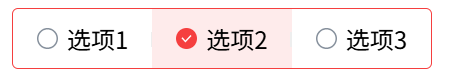

# colorful-radio-group

每个选项可以配置不同的颜色， 效果图：




## 使用
```tsx
<ColorfulRadioGroup
   defaultValue="1"
   options={[
     { label: "选项1", value: "1", color: "#52C41A" },
     { label: "选项2", value: "2", color: "#F53F3F" },
     { label: "选项3", value: "3", color: "orange" },
   ]}
/>
```

[在线演示](https://codesandbox.io/p/github/ikonan/colorful-radio-group/main?import=true)
